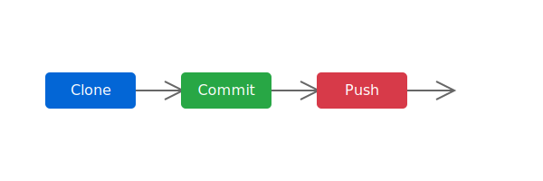

<div align="center">
  
  <h1>GitHub Practicals for Beginners</h1>
</div>

<p align="center">
  <a href="#overview">Overview</a> •
  <a href="#exercises">Exercises</a> •
  <a href="#getting-started">Getting Started</a> •
  <a href="#prerequisites">Prerequisites</a>
</p>

## 📋 Overview

Welcome to an enhanced learning experience for mastering Git and GitHub! This repository follows principles to provide a clean, accessible, and intuitive learning path for beginners on GitHub.

## 🎯 Exercises

Each exercise is carefully crafted with clear objectives and practical steps:

| Exercise | Description | Difficulty |
|----------|-------------|------------|
| [📝 Create Repository](/practice/01-create-repository.md) | Learn to create and initialize repositories | Beginner |
| [📥 Clone Repository](/practice/02-clone-repository.md) | Master the cloning process | Beginner |
| [💾 Make Changes & Commit](/practice/03-make-changes-and-commit.md) | Understand the staging and commit workflow | Beginner |
| [⬆️ Push Changes](/practice/04-push-changes-to-github.md) | Learn to push your work to remote | Beginner |
| [🌿 Manage Branches](/practice/05-create-and-switch-branches.md) | Work with branches effectively | Intermediate |
| [🔄 Create Pull Requests](/practice/06-create-pull-request.md) | Master the PR workflow | Intermediate |
| [🔨 Resolve Conflicts](/practice/07-resolve-merge-conflicts.md) | Handle merge conflicts | Intermediate |
| [🍴 Fork Repositories](/practice/08-fork-repository.md) | Learn repository forking | Intermediate |
| [🤝 Contribute to OSS](/practice/09-contribute-to-open-source.md) | Start contributing to open source | Advanced |
| [🌐 Setup GitHub Pages](/practice/10-setup-github-pages.md) | Deploy your project website | Advanced |

## 🚀 Getting Started

```bash
# Clone this repository
git clone https://github.com/your-username/github-for-beginners.git

# Navigate to the project directory
cd github-for-beginners

# Check exercise directories
ls practice/
```

## 📋 Prerequisites

- Git installed on your machine
- GitHub account
- Basic command line knowledge
- Text editor (VS Code recommended)

<div align="center">
  
</div>

## 💡 Pro Tips

- 📌 Each exercise has a dedicated branch
- 🎯 Complete exercises in order
- 🔄 Practice regularly
- 🤝 Join our community discussions

---

<div align="center">
  <p>Made with ❤️ for GitHub beginners</p>
  <p>Licensed under MIT</p>
</div>
